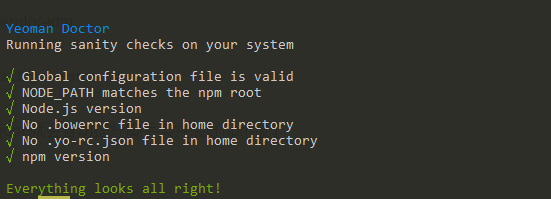
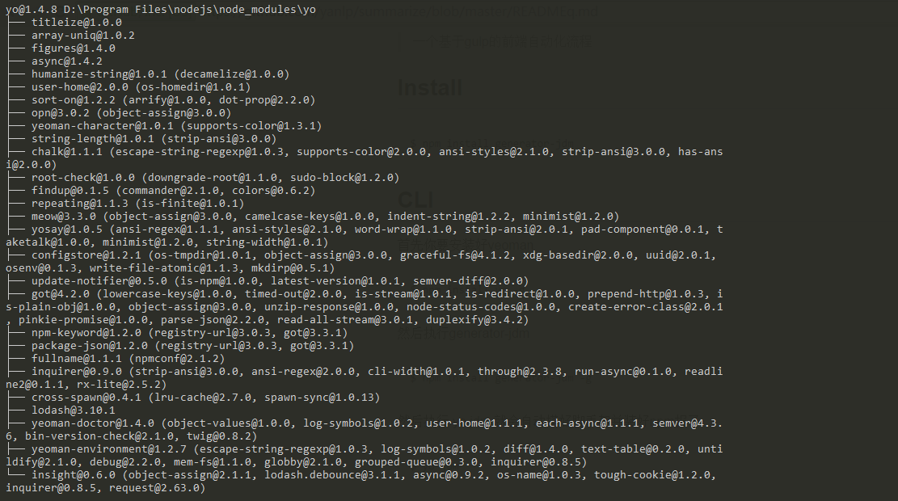
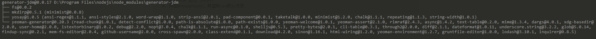
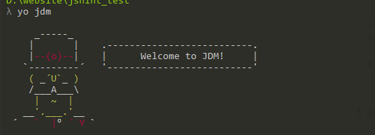
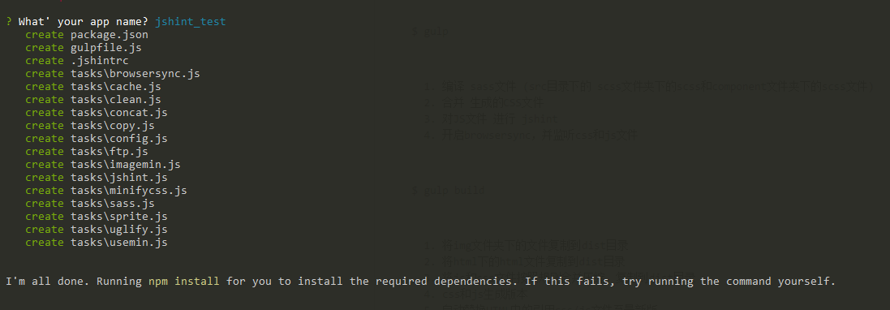
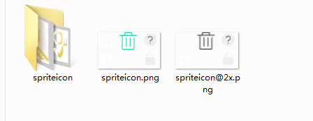

# generator-jdm

> 一个基于gulp的前端自动化流程


## Install

```
$ npm install generator-jdm
```


## CLI

首先你要安装好yeoman

```
$ npm install yo -g
```
</img>
</img>

然后执行generator-jdm
 
```
$ npm install generator-jdm -g
```

</img>

然后执行 yo jdm  就会自动搭好脚手架并装好npm报了

```
$ yo jdm
```



```
执行 yo jdm 并出现以上欢迎界面，接着就会提醒“what your app name？”
```
<b>pS:</b> 
     该处命名可以与根目录相同不会覆盖本目录，也可以写其他的名字
</img>

如果提醒出现
<b>I`m all done. Running <i>npm install</i> 
for you to install the required dependencies.If this fails,try running the command yourself</b>
      时，需要执行

```
$ npm install 
```

### 功能
```
$ gulp
```

      1. 编译 sass文件 (src目录下的 scss文件夹下的scss和component文件夹下的scss文件)
      2. 合并 生成的CSS文件
      3. 对JS文件 进行 jshint
      4. 开启browsersync，并监听css和js文件

```
$ gulp build
```

      1. 将img文件夹下的文件复制到dist目录
      2. 将html下的html文件复制到dist目录
      3. 将js和css文件按照规则合并压缩，复制到dist目录
      4. css和js生成版本
      5. 自动替换HTML中的引用css/js文件至最新版

```
$ gulp img
```

      1. 将src/img/sprite下的文件夹的.png图片，拼接成sprite图片;
         默认生成两种拼接图片：一是以图片所在文件夹的文件夹名命名的.png图片，另一种是，以文件夹命名@2x.png的拼接图,如图示;

</img>
```
<b>pS:</b>
      控制@2x类型的图片是否生成可通过更改
<strong>config.js</strong><font color="red"> imgRetina</font>
      属性值来控制是否生成@2x图片;
```

      2. 压缩所有image

```
$ gulp run
```

       执行 gulp default相同任务，除去监听和自动刷新
 
开发文件目录

```
|
+- src
|   +- css
|   +- scss
|   +- img
|       +- sprite
|   +- js
|       +- lib
|   +- component
|   - index.html
+- dist
|   +- css
|   +- img
|       +- sprite
|   +- js
|       +- lib
|   - index.html
```

## License

