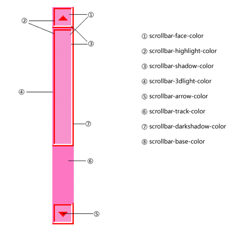
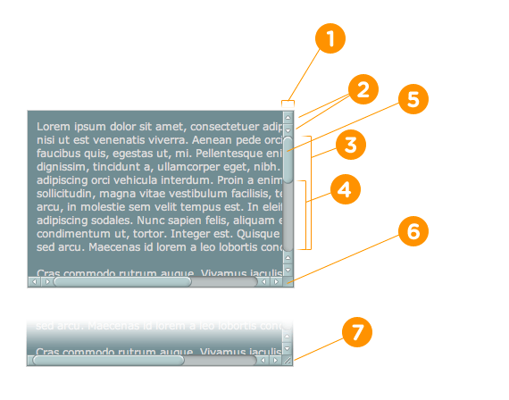

# 双十一项目支持总结
## 参与项目类别

>  **预热期主会场**   
>  **全局导航**
    
### 1、预热期主会场
**1.1 功能点**    

>* 文字轮播
>* 图片占位
>* 锚点定位
>* 滑屏定位

**1.2 样式小技巧**

>* 图片平铺
>* 自定义滚动条
>* 图片内部定位

#### 1.1.1 文字轮播

根据需求方要求，将轮播设置为循环轮播即 **1-2-3-4-1-2...**类似这种循环播放的效果        

>>html结构如下：
><code html>

	

		<ul id="newScroll">
			<li><a href="javascript:;">10.26-10.31 同是底价 爽购11天</a></li>
			<li><a href="javascript:;">10.26-10.31 同是底价 爽购10天</a></li>
			<li><a href="javascript:;">10.26-10.31 同是底价 爽购9天</a></li>
			<li><a href="javascript:;">10.26-10.31 同是底价 爽购8天</a></li>
		</ul>
	

</code>
>>js 样式如下
<code javascript>

	
</code>

#### 1.1.2 图片占位
**论图片占位的必要性：**一般本地加载图片没有网络延时看不到如果图片没有加载时，整个页面乱掉的状况，    
如果在线上在图片没有加载的情况下，原本应该加载图片的位置将会被已加载出来的dom结构就会占用，影响到    
整个用户的视觉体验；   
**论如何做到在图片加载给图片预留空地:**主要用到CSS的两个重要的样式标签padding-top、position，具    
体如下：        
    
>>html结构如下：

===================================================
<code html>
	
	
	

		<!--图片尺寸 200*400-->
		
	

</code>
**PS:** padding-top的计算:**H(图片的高度)/W(图片的宽度)x100%**，**img**标签必须是外围div的直属内部结构，否则这种样式将会失效;    
#### 1.1.3 锚点定位
**锚点**可以通过name属性和id属性完成
>>html样式
<code>

	

		....
	

	

		....
	

	

		....
	

	

		....
	

	//点击跳转
	

		<a href="#active-item1" class="j-nav-tab cur">精彩预售</a>
		<a href="#active-item2" class="j-nav-tab cur">热门活动</a>
		<a href="#active-item3" class="j-nav-tab cur">大牌盛宴</a>
		<a href="#active-item4" class="j-nav-tab cur">爆款排行</a>	
	

	
</code>

#### 1.1.4 滑屏定位
滑屏定位是在移动端经常会遇到的问题，如何准确定位？主要应用的**scrollTop**、**window.height**、**文档高度**;通过比较窗口滚动的距离确定当前的位置；
>> js实现
<code javascript>
	
    
</code>
#### 1.2.1 图片平铺总结
**平铺的方式**    1、无缝平铺；2、有空隙平铺
>> 对于无缝平铺不需要考虑太多，只需要将 **width** 平分父级元素的宽度即可，如果元素是**display:inline-block**    
则父级需要清除inline-block自身的4px的空隙；一般运用 font-size：0；letter-space：-4px；word-space：-4px；实    
现还原设置    

==============================================================================================
>>对于有空隙的平铺示例如下：以两个元素平铺为例
<code>

	
	

		
...

		
...

	

</code>
#### 1.2.2 自定义滚动条
#####自定义firefox浏览器滚动条

----------    

 **webkit内核浏览器的滚动条定制**
>>CSS
<code>
	
	CSS 注释对应表中的数字
    ::-webkit-scrollbar              { /* 1 */ }
    ::-webkit-scrollbar-button       { /* 2 */ }
    ::-webkit-scrollbar-track        { /* 3 */ }
    ::-webkit-scrollbar-track-piece  { /* 4 */ }
    ::-webkit-scrollbar-thumb        { /* 5 */ }
    ::-webkit-scrollbar-corner       { /* 6 */ }
    ::-webkit-resizer                { /* 7 */ }
</code>   
    

* ::-webkit-scrollbar 
	*  滚动条整体部分，其中的属性有width,height,background,border（就和一个块级元素一样）等。
* ::-webkit-scrollbar-button
	*  滚动条两端的按钮。可以用display:none让其不显示，也可以添加背景图片，颜色改变显示效果。
* ::-webkit-scrollbar-track        
	*  外层轨道。可以用display:none让其不显示，也可以添加背景图片，颜色改变显示效果。 
* ::-webkit-scrollbar-track-piece        
	* 内层轨道，滚动条中间部分（除去）。
* ::-webkit-scrollbar-thumb
	* 滚动条里面可以拖动的那部分
* ::-webkit-scrollbar-corner               
	* 边角
* ::-webkit-resizer                       
	* 定义右下角拖动块的样式
#### 1.2.3 图片定位
在接触次项目之前一直很纠结怎么才能把跟图片不相干的文字或图片还原设计稿，原来原理是这样的 
   
+  确定图片的尺寸以
+  确定要定位的dom相对与图片的位置
	+  量取dom结构在设计稿中相对图片的距离上（下）top、距离左（右）left的实际值，一般绝对定位相对值为 top/left
	+  top: top/width;
	+  left:left/height; 
    
**功成**